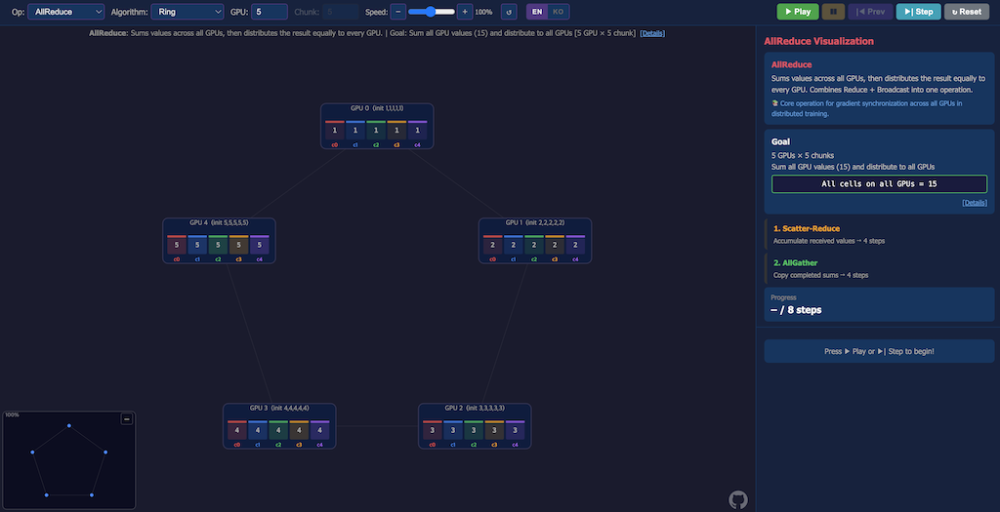

# gpu-comm-visualizer

https://hyojun.me/gpu-comm-visualizer

Web interactive visualization for understanding collective communication — the fundamental communication patterns used in distributed GPU computing. GPU communication libraries (NVIDIA NCCL, AMD RCCL) and distributed computing frameworks (MPI, Gloo) implement these patterns, and this tool helps you learn how they work.

Step through each algorithm at your own pace, or watch the animation play out in real time. See exactly how data moves between GPUs in Ring, Tree, and Naive (Direct) topologies.



## Supported Operations

| Operation | Algorithms | Description |
|-----------|-----------|-------------|
| AllReduce | Ring, Tree, Naive | Reduce + Broadcast in one step |
| Broadcast | Tree, Naive | Copy root's data to all GPUs |
| Reduce | Tree, Naive | Aggregate all data to root GPU |
| AllGather | Ring | Each GPU collects all unique chunks |
| ReduceScatter | Ring | Reduce and distribute chunks across GPUs |
| AllToAll | Naive | Personalized exchange between all GPUs |
| Gather | Naive | Collect unique chunks to root |
| Scatter | Naive | Distribute root's chunks to each GPU |

## Features

- Real-time animated data transfer between GPUs
- Step-by-step execution with forward/backward controls
- Adjustable speed (logarithmic scale, 8% ~ 1667%)
- Configurable GPU count and chunk count
- Zoom, pan, and minimap navigation
- Per-step transfer log with detailed value calculations
- URL parameter sync for sharing specific configurations
- Multi-language support (EN/KO)
- Dark theme UI


## URL Parameters

Share a specific configuration via URL:

```
?op=allreduce&alg=ring&gpu=4&chunk=4&speed=100&lang=en
```

| Parameter | Values |
|-----------|--------|
| `op` | `allreduce`, `broadcast`, `reduce`, `allgather`, `reducescatter`, `alltoall`, `gather`, `scatter` |
| `alg` | `ring`, `tree`, `naive` |
| `gpu` | Number of GPUs (min: 2) |
| `chunk` | Number of chunks (min: 2) |
| `speed` | Playback speed percentage |
| `lang` | `en`, `ko` |

## Local Development

```bash
# Install dependencies
make install

# Start dev server (http://localhost:3000)
make dev

# Production build
make build
```

## License

[MIT](./LICENSE)
